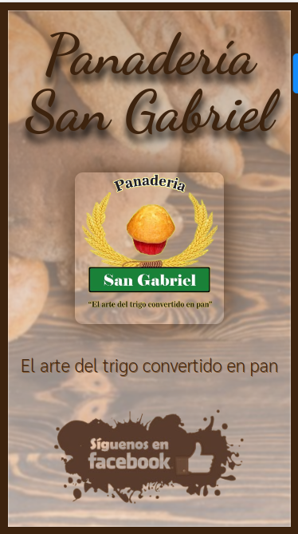

<a name="readme-top"></a>

<div align="center">
  <!-- You are encouraged to replace this logo with your own! Otherwise you can also remove it. -->

  <br/>

  <h1><b>Panadería San Gabriel Advertisement</b></h1>

</div>

<!-- TABLE OF CONTENTS -->

# 📗 Table of Contents

- [📗 Table of Contents](#-table-of-contents)
- [📖 Panadería San Gabriel Advertisement ](#-panadería-san-gabriel-advertisement-)
  - [🛠 Built With ](#-built-with-)
    - [Tech Stack ](#tech-stack-)
    - [Key Features ](#key-features-)
  - [🚀 Live Demo ](#-live-demo-)
  - [💻 Getting Started ](#-getting-started-)
    - [Prerequisites](#prerequisites)
    - [Setup](#setup)
    - [Install](#install)
    - [Usage](#usage)
    - [Run tests](#run-tests)
  - [👥 Authors ](#-authors-)
  - [🔭 Future Features ](#-future-features-)
  - [🤝 Contributing ](#-contributing-)
  - [⭐️ Show your support ](#️-show-your-support-)
  - [🙏 Acknowledgments ](#-acknowledgments-)
  - [📝 License ](#-license-)

<!-- PROJECT DESCRIPTION -->

# 📖 Panadería San Gabriel Advertisement <a name="about-project"></a>

<p style="text-align:center">
  
</p>

**[Panadería San Gabriel Advertisement]** is a simple page which function is display a bakery advertisement after the user scan a QR code. This advertisement contains a facebook link to redirect the user to the official bakery facebook page.

## 🛠 Built With <a name="built-with"></a>

### Tech Stack <a name="tech-stack"></a>

- HTML5
- CSS3

<!-- Features -->

### Key Features <a name="key-features"></a>

- **Link to redirect to the official bakery page**


<p align="right">(<a href="#readme-top">back to top</a>)</p>


## 🚀 Live Demo <a name="live-demo"></a>

[Live Demo Link](https://budgetsapp.onrender.com/)

<p align="right">(<a href="#readme-top">back to top</a>)</p> -->

<!-- GETTING STARTED -->

## 💻 Getting Started <a name="getting-started"></a>

To get a local copy up and running, follow these steps.

### Prerequisites

In order to run this project you need:

- Double click on index.html file and open with your favorite browser

### Setup

Clone this repository to your desired folder:

```sh
  git clone https://github.com/sambeck87/QRAdvertisement.git

```

### Install

You don't need to install

### Usage

You can use an open live server or double-click on the index.html file

### Run tests

This project doesn't contains tests

<p align="right">(<a href="#readme-top">back to top</a>)</p>

<!-- AUTHORS -->

## 👥 Authors <a name="authors" />

- 👤 **Sandro Hernandez**

  - GitHub: [@sambeck87](https://github.com/sambeck87)
  - Twitter: [@sambeck4488](https://twitter.com/sambeck4488)
  - LinkedIn: [LinkedIn](https://www.linkedin.com/in/sandro-israel-hern%C3%A1ndez-zamora-899386a4/)

<p align="right">(<a href="#readme-top">back to top</a>)</p>

<!-- FUTURE FEATURES -->

## 🔭 Future Features <a name="future-features"></a>

- [ ] **Add a direct Whatsapp link**

<p align="right">(<a href="#readme-top">back to top</a>)</p>


## 🤝 Contributing <a name="contributing"></a>

Contributions, issues, and feature requests are welcome!

Feel free to check the [issues page](https://github.com/sambeck87/QRAdvertisement/issues).

<p align="right">(<a href="#readme-top">back to top</a>)</p>

<!-- SUPPORT -->

## ⭐️ Show your support <a name="support"></a>

If you like this project, you can give star this repo.

<p align="right">(<a href="#readme-top">back to top</a>)</p>

<!-- ACKNOWLEDGEMENTS -->

## 🙏 Acknowledgments <a name="acknowledgements"></a>

I would like to thank San Gabriel Bakery to accept mi help to create this simple page.

<p align="right">(<a href="#readme-top">back to top</a>)</p>

## 📝 License <a name="license"></a>

This project is [MIT](./MIT.md) licensed.

<p align="right">(<a href="#readme-top">back to top</a>)</p>
